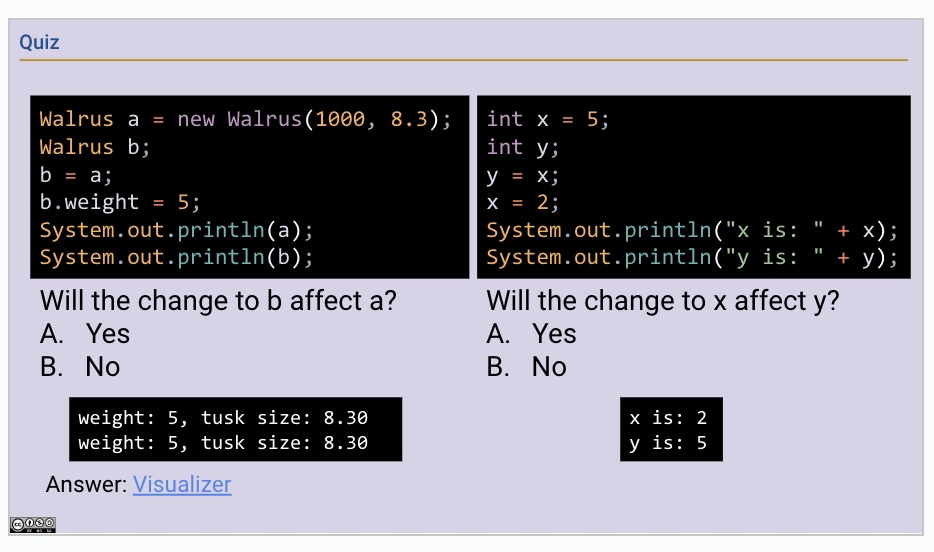

# Lec 1
## 1. Basics
In Javascript...
> Notate **CLASS**;
> use **{ }** to begin & end;
> end lines with **;**
### 1.1 Variables
- variables, parameters, and methods(func) have a TYPE.
- always declare **variable types**
- variable types can never change (cannot int -> string)
```js
int i = 0;
string j = "Hello World";
```
### 1.2 Types
- ```boolean```
Java uses `true` and `false`
- ```int```
Java `ints` have a (large) max and min value.
Eg. 1, 2, 3, 4, 5
- ```double```
Decimal values. 
Eg. 3.14159 / 123.456
Java `doubles` are again bounded.
- ```String```
Java `Strings` use **double quotes (")**
Eg. `"Hello World"`
- `char`
Java `char` represents a single character, and uses single quotes (').
### 1.3 Comments
`// This is a single line comment.`
### 1.4 Boolean Operators (the mini stuff)
- And: `&&`
- Or: `||`
- Not: `!`
- ==: `==` 
> In Java, `==` is used for identity, and `.equals()` is used for equality. 
## 2 Exponentials
```js
Math.pow(base, exp);
```
> Eg. `int x = Math.pow(2, 10);` is same to `x = 2 ** 10` in python.
> Have **NO** `2 ^ 10`
## 3 Print
```js
System.out.println("hello world");
```
## 4 Function Declaration and Usage
In Java, we call a function **Method**.
Each method returns only **ONE** value, and that value needs to be declared a **TYPE**.
> Method looks like: 
> ```js
> public static <TYPE of method> <Name>(<Input Type> <Input>){<Body>}
> ```
For example, to write a method that returns a string, we may use:
```js
public static String greet(String name){
    return "Hello, " + name;
}
```
This is equivalent to
```python
def greet(name):
    return "Hello, " + name
```
in python.

**NOTICE!!!**
- When a function returns nothing, it has a return type of `void`.
    - Eg. printing (returns nothing):`public static void`

## 5 Loops
### 5.1 While Loop
```js
int i = 0;
while (i < 10) {
    System.out.println(i);
    i++;
}
```
Add **( )** to conditions.
Notice the curly braces **{ }**.
`++` essentially means `+= 1`.
### 5.2 For Loop
#### For Loop Counting Up
Three important elements inside a `for` loop:
```js
for (initialization; termination; increment) {
    // loop body
}
```
Notice that **increment included in loop**.
For example, to print from <u>0 to 9</u>:
```js
for (int i = 0; i < 10; i ++) {
    System.out.println(i);
}
```
#### For Loop Counting Down
To print from <u>9 to 0</u>:
```js
for (int i = 9; i >= 0; i --) {
  System.out.println(i);
}
```

## 6 Conditionals
**ONE** if -> **MULTIPLE** else if -> **ONE** else
Format:
```js
if (condition){
body;
}... else if (condition){
body;
}... else {
// no condition needed this time!
body;
}
```
Eg.
```js
if (i % 3 == 0 && i % 5 == 0) {
    System.out.println("FizzBuzz");
} else if (i % 3 == 0) {
    System.out.println("Fizz");
} else if (i % 5 == 0) {
    System.out.println("Buzz");
} else {
    System.out.println(i);
}
```
## 7 Strings
**Define** a string: 
```js
String s = "Hello";
```
**Modify** string:
```js
s += " world";
s += 5;
```
Counting **Length**:
```js
int sLength = s.length();
```
**Slicing**:
```js
String substr = s.substring(1, 5);
```
> Note: same as `s[1:5]`

**Selecting**:
```js
char c = s.charAt(2);
```
> Note: same as `c = s[2]`

**Looking Up**:
JS does not have `in` to look up for strings.
Instead, use `.indexOf()` method.
When `x` not in `word`, the method **returns '-1'**.
**TO SEE IF A PART IS IN THE STRING** in Python,
```py
if "hello" in s:
    <body>
```
converts to:
```js
if (s.indexOf("hello") != -1){
<body>;
}
```
**TO FIND INDEX TO A LETTER**:
...first occurence!
```js
s = "hello world";
int index = s.indexOf('o');
```

**TO FIND LETTER BY GIVEN INDEX**:
Use `.charAT()` method.
```js
char letter = s.charAt(i);
```
assigns name `letter` the first-occurence index of letter `i` in string `s`.

## Programming
All codes in JS must be in **CLASS**
Everything inside a **METHOD**, if cannot find appropriate function, use `public static void main(String[] args)`.
Eg.
```js
public class LargerDemo {
   public static int larger(int x, int y) {
      if (x > y) {
         return x;
      }
      return y;
   }

   public static void main(String[] args) {
      System.out.println(larger(-5, 10));
   }
}

```
Where`System.out.println(larger(-5, 10))`only prints some simple lines, but **still need to be in a method**.

# Lec 2
In Java, we run and call method inside codes.
All method shall be called inside a **main method**.
```js
public static void main(String[] args) {
      Dog.makeNoise();
   }
```
> can be called either in the class it's defined, or other classes. **[CLASS DOESNT MATTER]**
## 1 WORLD IS A HUGE OOP!
### Dog
```js
public class Dog {
// this is the biggest class for dogs!
  public int weightInPounds;
// instance variable "weight"
// have to declare its TYPE!
  public Dog(int startingWeight) {
     weightInPounds = startingWeight;
  }
// = python's __init__ method
// make it possible when you input: 
// Dog(55), the dog's weightInPounds is 
// automatically bound to 55
  public void makeNoise() {
//non-static method: 
// vary according to each not, 
// not universal towards all
     if (weightInPounds < 10) {
        System.out.println("yipyipyip!");
     } else if (weightInPounds < 30) {
        System.out.println("bark. bark.");
     } else {
        System.out.println("woof!");
     }
  }
}

```
We say, **Classes can be instantiated as objects.**.
This means **<u>Dog</u>** class -> create **<u>instances</u>** of this Dog.
### Dog Launcher
Then having a DogLauncher where methods are called.
```js
public class DogLauncher {
   public static void main(String[] args) {
   //main  method to call  everything!
      Dog smallDog; // a name/variable
      new Dog(20); // a dog of weight 20
      smallDog = new Dog(5); // bind
      Dog hugeDog = new Dog(150);
      //do all above in one line
      smallDog.makeNoise();
      hugeDog.makeNoise();
      //after binding, call them all!
   }
}
```
### An Array of Objects
```js
Dog[] dogs = new Dog[2];
//Dog[]: create a list
//dogs: list name
//new Dog[2]: indicate that you have
//two objects in a list
dogs[0] = new Dog(8);
dogs[1] = new Dog(20);
//assign dogs' info
dogs[0].makeNoise();
```

## 2 Static VS. Non-Static
### Static Methos
```js
public static void makeNoise() {
   System.out.println("Bark!");
}
```
- invoked using the class name, e.g. `Dog.makeNoise();`
- can’t access “my” instance variables, because there is no “me”.
- Exist to serve some general things, such as `x = Math.round(5.6)` instead of `Math m = new Math(); x = m.round(x);`
### Non-Static Method
```js
public void makeNoise() {
   if (weightInPounds < 10) {
      System.out.println("yipyipyip!");
   } else if (weightInPounds < 30) {
      System.out.println("bark. bark.");
   } else { System.out.println("woof!"); }
}
```
- invoked using an instance name, e.g. `maya.makeNoise();`

## 3 Dogs Revisited: maxDog
We want to compare two dogs' weights, and ask the heavier dog to bark.
### Method 1: Using STATIC Method
Invoked as `Dog.maxDog(a, b)` and returns a dog from either `a` or `b`.
***Dog.java***
```js
public static Dog maxDog(Dog d1, Dog d2) {
     if (d1.weight > d2.weight) {
        return d1;
     }
     return d2;
  }
```
***DogLauncher.java***
```js
public static void main(String[] args) {
     Dog d = new Dog(15);
     Dog d2 = new Dog(100);
// making new dogs
     Dog bigger = Dog.maxDog(d, d2);
     bigger.makeNoise();
// assign instance bigger to what's returned
// by calling Dog.maxDog(d, d2)
// either d or d2
  }
```
### Method 2: Using NON-STATIC Method
Invoked by `dogname.maxDog(another dogname)`.
***Dog.java***
```js
public Dog maxDog(Dog d2) {
     if (weight > d2.weight) {
        return this; //this = self, which is Dog
     }
     return d2;
  }
```
***DogLauncher.java***
```js
bigger = d.maxDog(d2);
bigger.makeNoise();
```
## 4 Language Constructs [ref hw0B]
### 4.1 Fixed-Sized ArrayLists
> create an array with a **specified size**:
```js
int[] zeroedArray = new int[3];
//int[]: indicate this is of all integers
//zeroedArray: name of this created array
//new int[3]: three new items inside (length)
```
> create an array with **initial values**:
```js
int[] array = {4, 7, 10};
```
> **modify** terms
```js
array[0] = 5;
```
> **printing** terms
 ```js
System.out.println(array[0]);
//print #0 term
System.out.println(Arrays.toString(array));
//print entire array
System.out.println(array.length);
//print length
```
**NOTE!!**
- To print an array, call `Arrays.toString(array)`.
- Java does not support ~~negative indexing or slicing.~~

### 4.2 Enhanced For Loop
```js
int[] array = {1, 2, 3};
for (int i : array) {
// ":" = in
    System.out.println(i);
}
```
### 4.3 Resizable Lists
- create new list
```js
List<String> lst = new ArrayList<>();
//list of string objects named "lst"
```
- append by `listname.add("xxx")`
- modification by `listname.set(index,term)`
- find by `listname.get(index)`
- length by `listname.size()`
- boolean by `listname.contains("xxx")`
- Example!
```js
List<String> lst = new ArrayList<>();
lst.add("zero");
lst.add("one");
lst.set(0, "zed");
System.out.println(lst.get(0));
System.out.println(lst.size());
if (lst.contains("one")) {
    System.out.println("one in lst");
}
for (String elem : lst) {
    System.out.println(elem);
}
```
### 4.4 Sets
```js
Set<Integer> set = new HashSet<>();
```
There are two main implementations: TreeSet, and HashSet.
- TreeSet keeps its elements in “**<u>*sorted*</u>**” order, and is fast. 
- In contrast, HashSet does not have a defined “order”, but is (usually) really fast.

### 4.5 Dictionaries / Maps
```js
Map<String, String> map = new HashMap<>();
```
- Adding keys and values by`dicname.put(key, value)`
- look up keys by `dicname.get(keyname)`
- boolean by `dicname.containsKey(keyname)`
- iterate over keys by `dicname.keySet()`
- iterate over keys and values by `dicname.entrySet()`
- Example!
```js
Map<String, String> map = new HashMap<>();
map.put("hello", "hi");
map.put("hello", "goodbye");
System.out.println(map.get("hello"));
System.out.println(map.size());
if (map.containsKey("hello")) {
    System.out.println("\"hello\" in map");
}
for (String key : map.keySet()) {
    System.out.println(key);
}
```
Similarly, there are two main implementations: TreeMap, and HashMap. 
- A Map cannot contain ~~duplicate keys~~. If we try to add a key already in the map, **<u>*the value would be overwritten.*</u>**
## 5 Class
***ClassExample.java***
```js
//abstracting data!
public class Point {
    public int x;
    public int y;
    //setting variables that every instant should have
    
    public Point(int x, int y) {
        this.x = x;
        this.y = y;
    }
    //constructing Point
    
    public Point() {
        this(0, 0);
    }
    public double distanceTo(Point other) {
        return Math.sqrt(
            Math.pow(this.x - other.x, 2) +
            Math.pow(this.y - other.y, 2)
        )
    }
    //Methods!
    
    public void translate(int dx, int dy) {
        this.x += dx;
        this.y += dy;
    }
}

//to call methods, we make main method!
public static void main(String[] args) {
        Point p1 = new Point(5, 9);
        Point p2 = new Point(-3, 3);
        System.out.println("Point 1: ( " + p1.x
            + ", " + p1.y + ")");
        System.out.println("Distance: "
            + p1.distanceTo(p2));
        p1.translate(2, 2);
        System.out.println("Point 1: ( " + p1.x
            + ", " + p1.y + ")");
    }``
```
# Lec 3 [List1] IntList
## 1 Lists
To import lists into Java Language:
```js
import java.util.List;
import java.util.LinkedList;
List<String> L = new LinkedList<>();
```
> Mytery of Walrus!

class Walrus changes both a and b; integer x and y are independent!
## 2 Primitive Java Types
> 8 primitive types
- byte, short, **int**, long, floar, **double**, boolean, char

**When declaring a variable:**
- `int x` saves a spot for `x` without knowing what value `x` is.
- `x = -1234` binds value to integer `x`.
- `y = x` copies all the bits from `x` into ` y`. 
## 3 Reference Types
Everything except from 8 primitive types, is a **reference type**. 
**When instantiating an object**:
```js
Walrus someWalrus;
someWalrus = new Walrus(1000, 8.3);
```
 - allocates a box of bits for instance variables with a defalt value
- `Walrus b = a;` copies the arrow to the same instance as a;
## 4 Arrays
```js
int[] x = new int[]{0, 1, 2, 95, 4};
```
in `int[] a`, declearation creates a spot, **no object is instantiated.**
in `new int[]{0, 1, 2, 95, 4}` instantiates a new object (if not declared, anonymous!)
## 5 IntList and Linked Data Structures
```js
public class IntList {
   public int first;
   public IntList rest;

    /*Constructor*/
   public IntList(int f, IntList r) {
      first = f;
      rest = r;
   }
    /*Recursive Size Counter*/
  public int size() {
      if (rest == null) {
         return 1;
      }
      return 1 + this.rest.size();
   }
   
   /*get specific term*/
   public int get(int i) {
      if (i == 0) {
         return first;
      }
      return rest.get(i - 1);
   }
}
```
# Lec4 [List2] SLList
In this lecture, we look at improvements that could be made to `IntList` methods, primary to make programs more efficient and precise.
**IMPORTANT THING TO DIGEST!**
```js
public class SLList {
   private static class IntNode {
       public int item;
       public IntNode next;
       public IntNode(int i, IntNode n) {
          item = i;
          next = n;
       }
    }
   private IntNode sentinel;
   private int size;
// Constructors
// normal ones that takes one argument
   public SLList(int x) {
        //42 can be anything!
      sentinel = new IntNode(42, null);
      sentinel.next = new IntNode(x, null);
      size = 1;
   }
// empty ones that sets defalt value
   public SLList() {
      sentinel = new IntNode(42, null);
      size = 0;
   }
//Adds x to the front of the list. 
   public void addFirst(int x) {
      sentinel.next = new IntNode(x, sentinel.next)
      size += 1;
   }
// Returns the first item in the list. 
   public int getFirst() {
      return sentinel.next.item;
   }
//Adds an item to the end of the list. 
   public void addLast(int x) {
      IntNode p = sentinel;
      size += 1;
      /* Move p until it reaches the end of the list. */
      while (p.next != null) {
         p = p.next;
      }
      p.next = new IntNode(x, null);
   }
}
```
## 1. Rebranding and Culling
Comparison between `SLList` and `IntList`:
```Js
IntList X = new IntList(10, null);
SLList Y = new SLList(10);
// SLList is easier to instantiate!
```
## 2. `addFirst` and `getFirst`
defining helper functions
## 3. Access Control
Use the `private` keyword to prevent code in other classes from using members (or constructors) of a class:
```js
private static class IntNode {}
//and
private IntNode sentinel;
private int size;
```
Prevent stupid cases like ~~`L.first.next.next = L.first.next`~~!

## 4. Nested Classes
```js
public class SLList {
   private static class IntNode {
   ......
   private IntNode sentinel;
   private int size;
```
- `IntNode` is nested within `SLList` and is `private static class`;

> Declaring `sentinel` as `private IntNode sentinel` is allowed because:
    -  `SLList` has access to `IntNode` (since it's nested within the class). 
    - Even though `IntNode` is `static`, `sentinel` is an instance variable of type `IntNode`, meaning each instance of `SLList` will have its own sentinel node.
    
== 可以理解为“只有在class里面的东西”可以成为`private`，例如：
```js
private class xxx{}
//java会报错！
```
## 5. Efficiency
Sure thing we could compute size of lists recursively:
```js
private int size(IntNode p) {
      if (p.next == null)
         return 1;
      return 1 + size(p.next);
   }
   public int size() {
      return size(first);
   }
```
However it's way more efficient if we **track sizes all the way** instead of compute at the end, starting with `private int size;`.
## 6.Representing the Empty List
Defalt `first` to `null` is simple:
```js
public SLList() {
      first = null;
      size = 0;
   }
```
However, we ignore cases where we call `fist.next` and program will crash!
Now introduce `sentinel`:
```js
private IntNode sentinel;
...
    sentinel = new IntNode(63, null);
```
hence `sentinel.next`can never be `null`!
