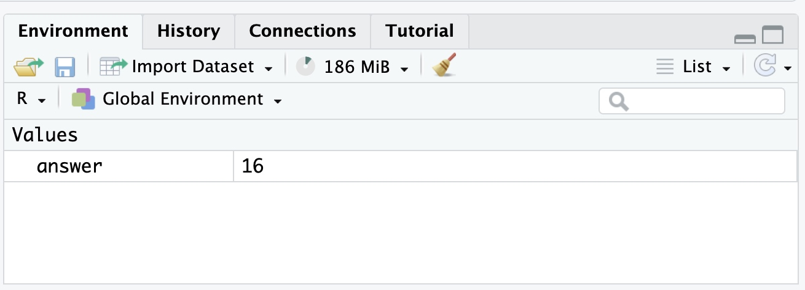
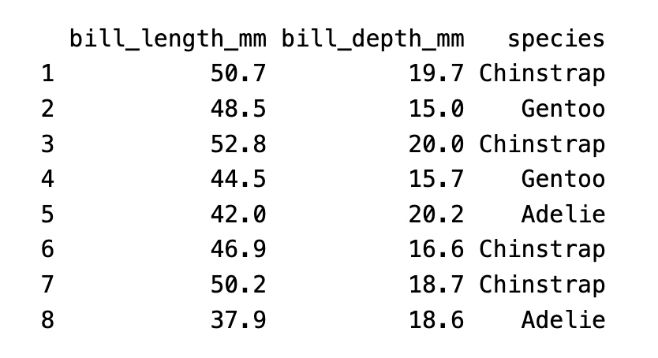

# THE ULTIMATE STAT20
## Sep 3 / The Taxonomy of Data
### 1. Data
An item of (chiefly numerical) information, name, number, picture…
### 2. Variable
A characteristic of an object or observational unit that can be measured and recorded.

#### - Numerical Value
DEF. take numbers as values and magnitude of the number has a quantitative meaning.
- **<u>Continuous Numerical Value</u>**: A numerical variable that takes values on an interval of the real number line.(eg. rounding temperature)
- **<u>Discrete Numerical Value</u>**: A numerical variable that takes values that have jumps between them.(eg. population cannot have 0.5 people)
#### - Categorical Value
DEF. take categories as values. Each unique category is called a level (eg.name)
- **<u>Ordinal Categorical Value</u>**: A categorical variable with levels that have a natural ordering. (eg. survey agree to disagree)
- **<u>Nominal Categorical Value</u>**: A categorical variable with levels with no 	ordering. (eg. name has no order)
### 3. Tutorial on R Studio
R: Language in DS;
R Studio: writing and running code through;
#### Save Objects
Add an assignment arrow `<-` and a name.
```r
answer <- 2 ^ (3 + 1)
```

**NOTE!!** No output is returned at the console.
#### Vectors
Store **multiple values** by putting inside `c()` separated by commas.
```s
my_fav_numbers <- c(9, 11, 19, 28)
```
The object `my_fav_numbers` is called a **vector**.
Vectors can store different types of data.
<u>Eg. strings</u>
```r
my_fav_colors <- c("green", "orange", "purple")
```
#### Functions
-> Mean / sqrt / log
```r
mean(my_fav_numbers)
sqrt(my_fav_numbers)
log(my_fav_numbers)
```
#### Penguins!
Store multiple observations into `bill_length_mm`.
```r
bill_length_mm <- c(50.7, 48.5, 52.8,
 44.5, 42.0, 46.9, 50.2, 37.9)
```
#### Check Class Types
Check vectors' class using the `class()` function.
1. Numeric Vectors: Numbers as data.
```r
class(my_fav_numbers)
[1] "numeric"
```
2. Character Vectors: Store text as data.
```r
class(my_fav_colors)
[1] "character"
``` 
3. Factor: Shows the possible values that this vector can take.
```r
char_vec <- c("cat", "cat", "dog")
fac <- factor(char_vec)
fac
[1] cat cat dog
Levels: cat dog
```
To specify preference order, 
```r
ordered_fac <- factor(char_vec,
levels = c("dog", "cat"))
```
#### Data Frames
So far, the data we collected:
```r
bill_length_mm <- c(50.7, 48.5, 52.8, 
44.5, 42.0, 46.9, 50.2, 37.9)
bill_depth_mm <- c(19.7, 15.0, 20.0, 
15.7, 20.2, 16.6, 18.7, 18.6)
species <- factor(c("Chinstrap", "Gentoo", 
"Chinstrap", "Gentoo", "Adelie",
 "Chinstrap", "Chinstrap", "Adelie"))
```
Create **Data Frame**, staple them together with data.frame().
```r
penguins_df <- data.frame(bill_length_mm, 
bill_depth_mm, species)
```


## Sep 5 / Summarizing Categorical Data
### 1. Contingency Table
> Count up the number of penguins that appeared in every combination of levels and lay them out in a table.
### 2. Bar Chart
The **stacked bar chart** puts one of the variables along the x-axis (the species) and <u>fills up the y-axis according to the counts</u> in each level of the other variable (the island); succeeds in <u>highlighting the total number of Adelie penguins</u>.
The **side-by-side bar chart** is similar, but unstacks the “Adelie” bar to <u>put the three islands besides one another</u>;easier to see at a glance <u>the relative sizes</u>.
### 3. From Counts to Proportions
#### Joint Proportion
The proportion of observations of multiple variables that appear in a combination of levels of those variables.
> single / all
#### Marginal Proportion
The proportion of observations in one variable that appear in a single level of that variable.
> sum of one type / all
#### Conditional Proportion
The proportion of observations in one level of one variable that appear in a level of a second variable.
> feature a / feature b
### 4. Identifying an association
There is an association between two categorical variables if the conditional proportions vary as you move from one one level of the conditioning variable to the next.
### 5. Tutorial on R Studio
#### help
```r
?<your function>
```
#### Mean
Use a single **unnamed** argument:
```r
my_fav_numbers <- c(9, 11, 19, 28)
mean(my_fav_numbers)
```
**Named** argument:
```r
mean(x = my_fav_numbers)
```
`trim` from lower and upper end:
```r
mean(my_fav_numbers, .25)
mean(x = my_fav_numbers, trim = .25)
```
#### Libraries
Any installed library can be loaded with the `library()` function. 
```r
library(tidyverse)
```
#### Add data
Using the named `data` function.
```r
data(penguins)
```
### 6. Visualization with `ggplot2`
> **ggplot**
- `data` = a data frame
- `mapping` = horizontal axis / aesthetic attribute of the plot
> **aesthetic**
- `aes()`
- horizontal axis `x`
- `fill` = coloring according to variables
> **geom bar**
- `geom()`
- add to new layer by `+`
- `position` == `"fill"` to normalize; `nothing`to stack graph
```r
> library(stat20data)
> library(tidyverse)
ggplot(data = penguins, 
       mapping = aes(x = species, 
                     fill = island)) +
  geom_bar(position = "fill")
```
### 7. Some Tools
```r
> colnames(class_survey)
# get column names

> head(class_survey$year)
# first six of "year" title
 
> library(dplyr)
> glimpse(class_survey)
# get glimpse of data
```