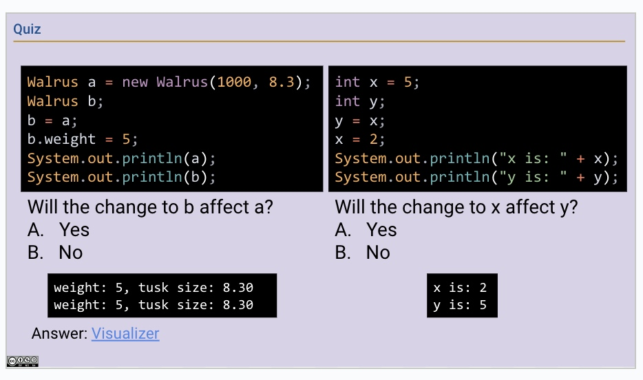

# Lec 3 [List1] IntList
## 1 Lists
To import lists into Java Language:
```js
import java.util.List;
import java.util.LinkedList;
List<String> L = new LinkedList<>();
```
> Mytery of Walrus!

class Walrus changes both a and b; integer x and y are independent!
## 2 Primitive Java Types
> 8 primitive types
- byte, short, **int**, long, floar, **double**, boolean, char

**When declaring a variable:**
- `int x` saves a spot for `x` without knowing what value `x` is.
- `x = -1234` binds value to integer `x`.
- `y = x` copies all the bits from `x` into ` y`. 
## 3 Reference Types
Everything except from 8 primitive types, is a **reference type**. 
**When instantiating an object**:
```js
Walrus someWalrus;
someWalrus = new Walrus(1000, 8.3);
```
 - allocates a box of bits for instance variables with a defalt value
- `Walrus b = a;` copies the arrow to the same instance as a;
## 4 Arrays
```js
int[] x = new int[]{0, 1, 2, 95, 4};
```
in `int[] a`, declearation creates a spot, **no object is instantiated.**
in `new int[]{0, 1, 2, 95, 4}` instantiates a new object (if not declared, anonymous!)
## 5 IntList and Linked Data Structures
```js
public class IntList {
   public int first;
   public IntList rest;

    /*Constructor*/
   public IntList(int f, IntList r) {
      first = f;
      rest = r;
   }
    /*Recursive Size Counter*/
  public int size() {
      if (rest == null) {
         return 1;
      }
      return 1 + this.rest.size();
   }
   
   /*get specific term*/
   public int get(int i) {
      if (i == 0) {
         return first;
      }
      return rest.get(i - 1);
   }
}
```
