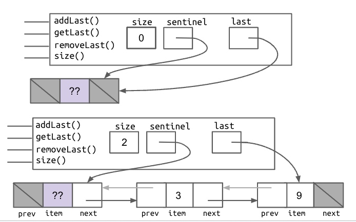
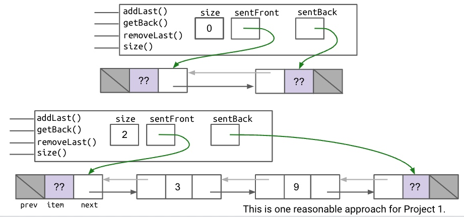
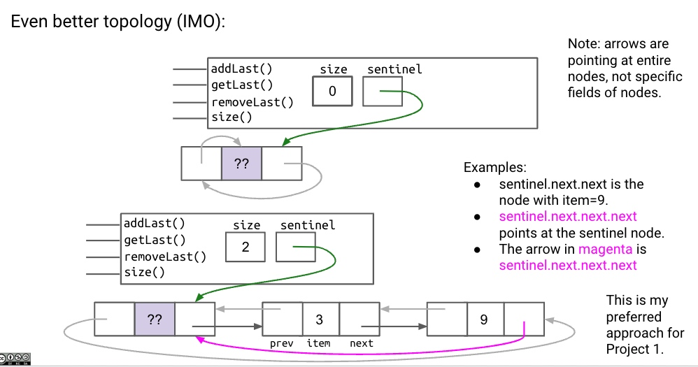
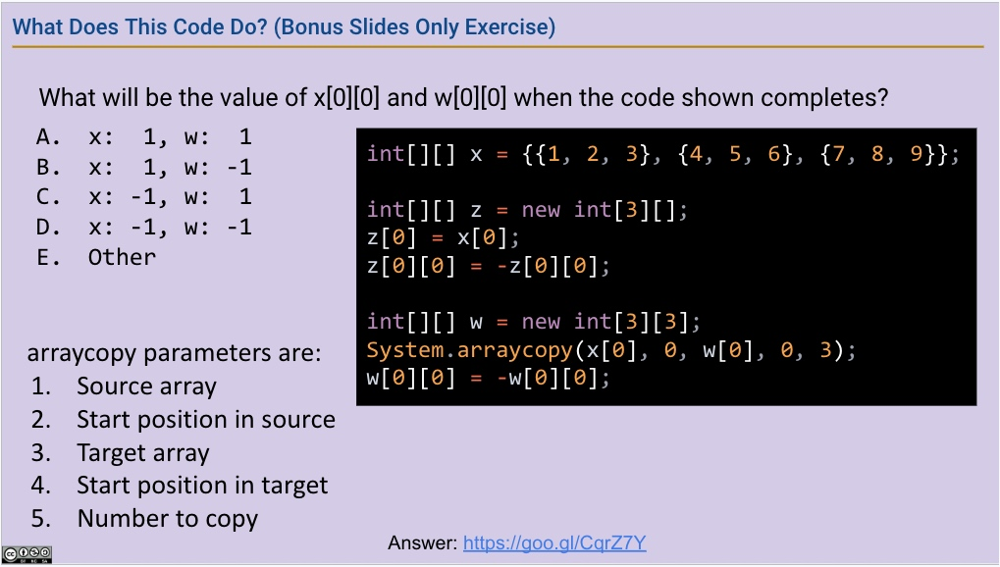

# Lec5 [List3] DLList
Continue the improvements from `intList`!
Realizing `addLast` may still have long run time, we try to add a `last` isntance to keep track of the ending node, yet `removeLast` is still slow!
Now we introduce our **Double Linked List** notes as `DLList`.
## 1 The Naive Doubly List
For each node (including the `sentinel`) we have a `prev` and `next` part, using pointers to denotate its previous or next `IntNode` object.

 However, in this case the `last` pointer sometimes points at the sentinel, sometimes points at a real node -- depends whether you've removed everything behind?
 To solve that issue, we come up with two different methods: **Double Sentinel** and **IMO**.
## 2 [sol1] Double Sentinel

Both at front and at back, include a sentinel so all actual nodes are in between, and `last` (in this case `sentBack`) will never point to `sentFront`.
## 3 [sol2] Circular Sentinel

Arrows from the first grid always point to the last Node; the ending Node always points back to the first Node.
## 4 Grammar: Generic Lists
To include more data types not only `int`!
When declaring class name, we use `<Random Name>` as a placeholder name, which will **get replaced by the true data type each time  a new object is instantiated**.
> In the following code, you will see:
- changed all the `int` type into `LochNess`;
- `IntNode` renamed to `StuffNode`;
- arguments can be `LochNess` as well.
- **NOTE!** `<LochNess>` is nothing but a replacable name, can be replaced with anything!
```js
public class SLList<LochNess> {
// using <LochNess> to broader the data type limit
   private StuffNode sentinel;
   private int size;
   private class StuffNode {
      public LochNess item;
      // item can be "undetermined type" too
      public StuffNode next;
      public StuffNode(LochNess i, StuffNode n) {
         item = i;
         next = n;
      }
   }
   public SLList(LochNess x) {
      sentinel = new StuffNode(null, null);
      sentinel.next = new StuffNode(x, null);
      size = 1;
   }
   public SLList() {
      sentinel = new StuffNode(null, null);
      size = 0;
   }
   public void addFirst(LochNess x) {
      sentinel.next = new StuffNode(x, sentinel.next);
      size += 1;
   }
   public LochNess getFirst() {
      return sentinel.next.item;
   }
   public void addLast(LochNess x) {
      size += 1;
      StuffNode p = sentinel;
      while (p.next != null) {
         p = p.next;
      }
      p.next = new StuffNode(x, null);
   }
```
With  all these being set, we **set types when declaring**:
```js
SLList<Integer> s1 = new SLList<>(5);
s1.addFirst(10);
SLList<String> s2 = new SLList<>("hi");
s2.addFirst("apple");
```
To the left, we put data types inside`<>`;
to  the right, there's no need to name it again!
### a quick summation
- In the .java file **implementing** your data structure, specify your “generic type” only once at the very top of the file.
    ```js
    public class SLList<LochNess> {...}
    ```
- Write out desired type during **declaration**.
Use the empty diamond operator `<>` during **instantiation**.
    ```js
    DLList<Double> s1 = new DLList<>(5.3);
    ```
## 5 Array Overview
Arrays are a special kind of object which consists of **a numbered sequence of memory boxes**.
- To **get** `i`th item of array A, use `A[i]`.
- Unlike class instances which have have named memory boxes.

**Arrays consist of:**
> - A **<u>fixed</u>** integer length (cannot change!)
> - A sequence of `N` memory boxes where `N=length`, such that:
>     - All of the boxes hold the same type of value (and have same # of bits).
>     - 0 The boxes are numbered **<u>0 through length-1</u>**.

**Like instances of classes:**
> - You get one **reference** when its created.
> - If you reassign all variables containing that reference, you can never get the array back.

## 6 Basic Array Syntax
Three ways you may instantiate an `array`, having same features of:
- A **length** field.
- A sequence of **N boxes**, where **N = length**.
```js
x = new int[3];
y = new int[]{1, 2, 3, 4, 5};
int[] z = {9, 10, 11, 12, 13};
```
## 7 method Arraycopy
```js
System.arraycopy(b,0,x,3,2)
``` 
The order of arguments:
* Source array
* Start position in source
* Target array
* Start position in target
* Number to copy

Equivalent to: copy **2** items from b to a, starting at b's 0th position to a's 3th position.
 == python's `x[3:5] = b[0:2]`.
 
## 8 2D Arrays
We've seen enough example of one-dimensinal arrays, now, we'll take a look into two-dimensional ones that creates an array of arrays!
```js
int[][] pascalsTriangle;
pascalsTriangle = new int[4][];
int[] rowZero = pascalsTriangle[0]
```
In the code above, `pascalsTriangle` is an 4-box-array that stores arrays.
`RowZero` always points to the first term of `PascalTriangle`.

The first `[]` indicates the array's length;
the `[]` right after indicates the length of arrays inside the array boxes.
> Eg. `int[4][7]` essentially means a 4-box-array that consists of arrays of length 7.

To **add values** into arrays,
```js
pascalsTriangle[0] = new int[]{1};
pascalsTriangle[1] = new int[]{1, 1};
pascalsTriangle[2] = new int[]{1, 2, 1};
pascalsTriangle[3] = new int[]{1, 3, 3, 1};
int[] rowTwo = pascalsTriangle[2];
rowTwo[1] = -5;
```
Good Practice!

Ans: [https://goo.gl/CqrZ7Y](https://goo.gl/CqrZ7Y)

## 9 Arrays vs. Classes
- Accessing:
    - Array boxes are accessed using `[] `notation.
    - Class boxes are accessed using `dot` notation.
- Types:
    - Array boxes must all be of the **same type**.
    - Class boxes may be of **different types.**
- Mutual: Both have a **fixed number of boxes.**


